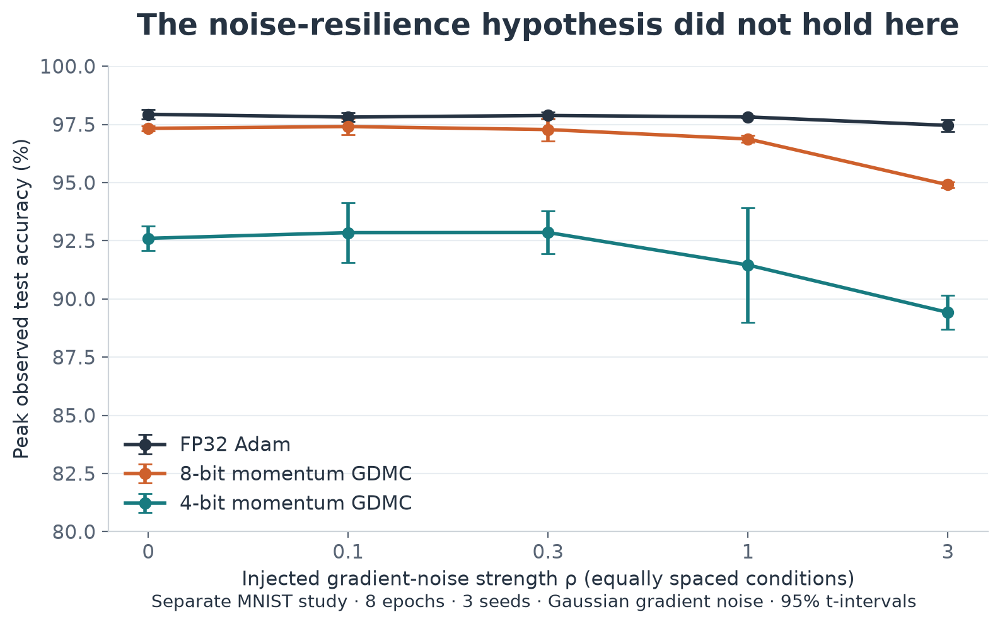
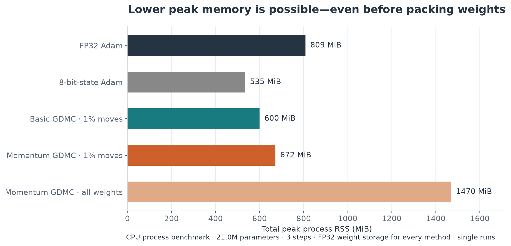

# GDMC blog: data and methods companion

This companion contains the complete primary comparison and supporting studies. The main article is in `article.md`. All percentages below are calculated from saved per-run CSVs, not transcribed from earlier prose reports.

## Primary experiment

Experiment 15 trains a 784–256–256–10 ReLU MLP from scratch for 10 epochs. Each task uses 55,000 fitting examples, 5,000 validation examples and 10,000 official test examples, with batch size 128. MNIST has 10 evaluation seeds (0–9); Fashion-MNIST has 8 (0–7). There are 288 final runs. Weight grids are uniform in [−1,1], with 4, 16 and 256 levels. These even-sized symmetric grids do not contain exactly zero. They are not interchangeable with every integer quantization convention.

The four direct-grid methods each receive three validation candidates using seed 100 and a four-epoch tuning horizon. Basic/momentum GDMC tune β ∈ {1,2,4}, with k=1 and move_frac=0.01; momentum uses β₁=0.9. Projected Adam and projected momentum SGD tune learning rate / grid spacing ∈ {0.25,0.5,1}. Projected SGD uses momentum 0.9. QAT and FP32 Adam each use a fixed learning rate of 0.001; they do not receive the three-candidate search. No learning-rate decay is used. Equal candidate counts do not imply equally effective search ranges: the projected SGD baseline is nearly frozen at 8 bits and needs a broader search before a strong comparison with SGD is possible.

Final accuracy is the last recorded evaluation. Peak accuracy is each run's maximum test accuracy over logged evaluations: it is a descriptive, test-selected statistic, not a validation-selected checkpoint score. Pairing matches random seeds across methods. Reported intervals are ordinary 95% t-intervals across seeds; paired-effect intervals use within-seed differences. They quantify seed variation, not generalization across datasets or uncertainty from model/hyperparameter selection. No multiple-comparison correction is applied. No power analysis is claimed.

QAT qualification: matrix weights are quantized by STE during training, but biases remain continuous. Evaluation snaps all parameters including biases. Direct-grid methods quantize biases during training too. Thus the QAT result is provisional, with a different training policy; a corrected comparison should harmonize biases. All weights, gradients and momentum buffers in this prototype are physically floating-point tensors. Low-bit here describes allowed weight values, not packed storage or low-bit arithmetic.

## MNIST: final accuracy

|                        |      2 |      4 |      8 |     32 |
|:-----------------------|-------:|-------:|-------:|-------:|
| Basic GDMC             |  77.68 |  89.21 |  94.26 | nan    |
| Momentum GDMC          |  40.99 |  93.35 |  97.43 | nan    |
| Projected Adam         |  46.35 |  49.07 |  97.07 | nan    |
| Projected momentum SGD |  38.53 |  42.70 |   9.47 | nan    |
| QAT (provisional)      |  93.54 |  97.70 |  97.68 | nan    |
| FP32 Adam              | nan    | nan    | nan    |  97.91 |

## Fashion-MNIST: final accuracy

|                        |      2 |      4 |      8 |     32 |
|:-----------------------|-------:|-------:|-------:|-------:|
| Basic GDMC             |  55.66 |  75.42 |  84.73 | nan    |
| Momentum GDMC          |  29.23 |  75.07 |  87.51 | nan    |
| Projected Adam         |  35.90 |  55.89 |  86.34 | nan    |
| Projected momentum SGD |  47.52 |  61.83 |   9.38 | nan    |
| QAT (provisional)      |  75.72 |  87.90 |  88.31 | nan    |
| FP32 Adam              | nan    | nan    | nan    |  88.41 |

## All primary estimates and intervals

| dataset   | method         |   bits | metric         |   n |   mean_pct |   ci_low_pct |   ci_high_pct |
|:----------|:---------------|-------:|:---------------|----:|-----------:|-------------:|--------------:|
| fashion   | adam-fp32      |     32 | best_test_acc  |   8 |     88.536 |       88.353 |        88.720 |
| fashion   | adam-fp32      |     32 | final_test_acc |   8 |     88.407 |       88.190 |        88.625 |
| fashion   | gdmc-v1        |      2 | best_test_acc  |   8 |     65.835 |       64.471 |        67.199 |
| fashion   | gdmc-v1        |      2 | final_test_acc |   8 |     55.663 |       53.093 |        58.232 |
| fashion   | gdmc-v1        |      4 | best_test_acc  |   8 |     76.312 |       75.583 |        77.042 |
| fashion   | gdmc-v1        |      4 | final_test_acc |   8 |     75.419 |       74.343 |        76.494 |
| fashion   | gdmc-v1        |      8 | best_test_acc  |   8 |     84.744 |       84.649 |        84.839 |
| fashion   | gdmc-v1        |      8 | final_test_acc |   8 |     84.727 |       84.628 |        84.827 |
| fashion   | gdmc-v2        |      2 | best_test_acc  |   8 |     32.738 |       30.303 |        35.172 |
| fashion   | gdmc-v2        |      2 | final_test_acc |   8 |     29.234 |       21.980 |        36.487 |
| fashion   | gdmc-v2        |      4 | best_test_acc  |   8 |     79.251 |       78.429 |        80.074 |
| fashion   | gdmc-v2        |      4 | final_test_acc |   8 |     75.068 |       72.768 |        77.367 |
| fashion   | gdmc-v2        |      8 | best_test_acc  |   8 |     87.510 |       87.311 |        87.709 |
| fashion   | gdmc-v2        |      8 | final_test_acc |   8 |     87.507 |       87.307 |        87.708 |
| fashion   | projected-adam |      2 | best_test_acc  |   8 |     73.509 |       71.931 |        75.086 |
| fashion   | projected-adam |      2 | final_test_acc |   8 |     35.895 |       26.119 |        45.671 |
| fashion   | projected-adam |      4 | best_test_acc  |   8 |     75.279 |       73.676 |        76.881 |
| fashion   | projected-adam |      4 | final_test_acc |   8 |     55.891 |       43.103 |        68.679 |
| fashion   | projected-adam |      8 | best_test_acc  |   8 |     86.659 |       86.459 |        86.858 |
| fashion   | projected-adam |      8 | final_test_acc |   8 |     86.335 |       86.000 |        86.670 |
| fashion   | projected-msgd |      2 | best_test_acc  |   8 |     49.614 |       39.100 |        60.128 |
| fashion   | projected-msgd |      2 | final_test_acc |   8 |     47.516 |       37.515 |        57.517 |
| fashion   | projected-msgd |      4 | best_test_acc  |   8 |     63.635 |       62.292 |        64.978 |
| fashion   | projected-msgd |      4 | final_test_acc |   8 |     61.831 |       59.538 |        64.125 |
| fashion   | projected-msgd |      8 | best_test_acc  |   8 |      9.377 |        7.776 |        10.979 |
| fashion   | projected-msgd |      8 | final_test_acc |   8 |      9.377 |        7.776 |        10.979 |
| fashion   | qat-ste-adam   |      2 | best_test_acc  |   8 |     77.900 |       76.314 |        79.486 |
| fashion   | qat-ste-adam   |      2 | final_test_acc |   8 |     75.718 |       73.333 |        78.102 |
| fashion   | qat-ste-adam   |      4 | best_test_acc  |   8 |     87.981 |       87.824 |        88.139 |
| fashion   | qat-ste-adam   |      4 | final_test_acc |   8 |     87.903 |       87.695 |        88.110 |
| fashion   | qat-ste-adam   |      8 | best_test_acc  |   8 |     88.535 |       88.309 |        88.761 |
| fashion   | qat-ste-adam   |      8 | final_test_acc |   8 |     88.309 |       87.928 |        88.690 |
| mnist     | adam-fp32      |     32 | best_test_acc  |  10 |     98.013 |       97.970 |        98.056 |
| mnist     | adam-fp32      |     32 | final_test_acc |  10 |     97.915 |       97.787 |        98.043 |
| mnist     | gdmc-v1        |      2 | best_test_acc  |  10 |     79.665 |       79.268 |        80.062 |
| mnist     | gdmc-v1        |      2 | final_test_acc |  10 |     77.679 |       76.786 |        78.572 |
| mnist     | gdmc-v1        |      4 | best_test_acc  |  10 |     89.532 |       89.304 |        89.760 |
| mnist     | gdmc-v1        |      4 | final_test_acc |  10 |     89.212 |       88.918 |        89.506 |
| mnist     | gdmc-v1        |      8 | best_test_acc  |  10 |     94.268 |       94.157 |        94.379 |
| mnist     | gdmc-v1        |      8 | final_test_acc |  10 |     94.260 |       94.145 |        94.375 |
| mnist     | gdmc-v2        |      2 | best_test_acc  |  10 |     49.446 |       45.150 |        53.742 |
| mnist     | gdmc-v2        |      2 | final_test_acc |  10 |     40.986 |       36.295 |        45.677 |
| mnist     | gdmc-v2        |      4 | best_test_acc  |  10 |     93.515 |       93.069 |        93.961 |
| mnist     | gdmc-v2        |      4 | final_test_acc |  10 |     93.354 |       92.796 |        93.912 |
| mnist     | gdmc-v2        |      8 | best_test_acc  |  10 |     97.438 |       97.369 |        97.507 |
| mnist     | gdmc-v2        |      8 | final_test_acc |  10 |     97.427 |       97.357 |        97.497 |
| mnist     | projected-adam |      2 | best_test_acc  |  10 |     79.599 |       70.618 |        88.580 |
| mnist     | projected-adam |      2 | final_test_acc |  10 |     46.347 |       30.051 |        62.643 |
| mnist     | projected-adam |      4 | best_test_acc  |  10 |     91.703 |       90.900 |        92.506 |
| mnist     | projected-adam |      4 | final_test_acc |  10 |     49.068 |       28.222 |        69.914 |
| mnist     | projected-adam |      8 | best_test_acc  |  10 |     97.389 |       97.225 |        97.553 |
| mnist     | projected-adam |      8 | final_test_acc |  10 |     97.068 |       96.854 |        97.282 |
| mnist     | projected-msgd |      2 | best_test_acc  |  10 |     40.938 |       30.919 |        50.957 |
| mnist     | projected-msgd |      2 | final_test_acc |  10 |     38.526 |       28.373 |        48.679 |
| mnist     | projected-msgd |      4 | best_test_acc  |  10 |     43.055 |       33.039 |        53.071 |
| mnist     | projected-msgd |      4 | final_test_acc |  10 |     42.704 |       32.681 |        52.727 |
| mnist     | projected-msgd |      8 | best_test_acc  |  10 |      9.470 |        7.718 |        11.222 |
| mnist     | projected-msgd |      8 | final_test_acc |  10 |      9.470 |        7.718 |        11.222 |
| mnist     | qat-ste-adam   |      2 | best_test_acc  |  10 |     94.223 |       94.007 |        94.439 |
| mnist     | qat-ste-adam   |      2 | final_test_acc |  10 |     93.544 |       93.113 |        93.975 |
| mnist     | qat-ste-adam   |      4 | best_test_acc  |  10 |     97.858 |       97.751 |        97.965 |
| mnist     | qat-ste-adam   |      4 | final_test_acc |  10 |     97.704 |       97.574 |        97.834 |
| mnist     | qat-ste-adam   |      8 | best_test_acc  |  10 |     98.055 |       97.969 |        98.141 |
| mnist     | qat-ste-adam   |      8 | final_test_acc |  10 |     97.680 |       97.448 |        97.912 |

## Paired 4-bit effects

All quantities are percentage-point differences, momentum GDMC minus projected Adam. Peak and final metrics are separate, not interchangeable evidence.

| dataset   |   bits | metric         |   n |   mean_pp |   ci_low_pp |   ci_high_pp |   positive_seeds |
|:----------|-------:|:---------------|----:|----------:|------------:|-------------:|-----------------:|
| mnist     |      4 | best_test_acc  |  10 |     1.812 |       0.950 |        2.674 |               10 |
| fashion   |      4 | best_test_acc  |   8 |     3.973 |       2.283 |        5.662 |                8 |
| mnist     |      4 | final_test_acc |  10 |    44.286 |      23.342 |       65.230 |               10 |
| fashion   |      4 | final_test_acc |   8 |    19.176 |       6.774 |       31.579 |                8 |

## Supporting noise study

Experiment 14 uses a separate MNIST protocol: eight epochs, the full 60K training set, three seeds, and Gaussian noise scaled by each tensor's gradient RMS. Noise is injected into the gradient used for the update; acceptance losses are not directly perturbed. It compares low-bit GDMC to FP32 Adam, not to an equivalently quantized Adam baseline. These results do not establish whether GDMC is more noise-tolerant than other direct-grid methods. The unchanged acceptance-ablation scores are specific to this setup and temperature/move-size range.



## Supporting memory study

Experiment 13 isolates each optimizer in a fresh CPU process, using a 20,979,712-parameter MLP for three steps. These are single-run process RSS measurements, not GPU allocator peaks or averages. The pre-step-to-peak increase includes gradients, activations and scratch space as well as optimizer state. Do not interpret it as optimizer-state size alone. Every method uses FP32 weight storage. The custom 8-bit-state Adam baseline is this repository's implementation, not a measurement of a third-party library.



| method      |   params |   steps |   base_mb |   peak_mb |   growth_mb |   growth_bytes_per_param |   state_bytes_per_param |   grad_bytes_per_param |   weight_bytes_per_param |
|:------------|---------:|--------:|----------:|----------:|------------:|-------------------------:|------------------------:|-----------------------:|-------------------------:|
| adam        | 20979712 |       3 |    361.67 |    808.53 |      446.86 |                    22.33 |                    8.00 |                   4.00 |                     4.00 |
| adam8bit    | 20979712 |       3 |    358.44 |    535.03 |      176.59 |                     8.83 |                    2.01 |                   4.00 |                     4.00 |
| gdmc-v1     | 20979712 |       3 |    364.11 |    600.27 |      236.16 |                    11.80 |                    0.00 |                   4.00 |                     4.00 |
| gdmc-v2     | 20979712 |       3 |    361.73 |    671.73 |      310.00 |                    15.49 |                    4.00 |                   4.00 |                     4.00 |
| gdmc-v2-mf1 | 20979712 |       3 |    357.95 |   1470.47 |     1112.52 |                    55.60 |                    4.00 |                   4.00 |                     4.00 |

## Complete noise-study means

Both accuracy columns are percentages. These cells belong to the separate eight-epoch, three-seed protocol above.

| label                   |   bits |   rho |   seeds |   peak_accuracy |   final_accuracy |
|:------------------------|-------:|------:|--------:|----------------:|-----------------:|
| adam                    |     32 | 0.000 |       3 |          97.933 |           97.860 |
| adam                    |     32 | 0.100 |       3 |          97.813 |           97.730 |
| adam                    |     32 | 0.300 |       3 |          97.883 |           97.883 |
| adam                    |     32 | 1.000 |       3 |          97.820 |           97.790 |
| adam                    |     32 | 3.000 |       3 |          97.457 |           97.450 |
| gdmc-b4-accept          |      4 | 0.000 |       3 |          92.603 |           92.290 |
| gdmc-b4-accept          |      4 | 0.100 |       3 |          92.847 |           92.137 |
| gdmc-b4-accept          |      4 | 0.300 |       3 |          92.853 |           91.887 |
| gdmc-b4-accept          |      4 | 1.000 |       3 |          91.457 |           91.237 |
| gdmc-b4-accept          |      4 | 3.000 |       3 |          89.420 |           85.263 |
| gdmc-b8-accept          |      8 | 0.000 |       3 |          97.330 |           97.330 |
| gdmc-b8-accept          |      8 | 0.100 |       3 |          97.407 |           97.407 |
| gdmc-b8-accept          |      8 | 0.300 |       3 |          97.277 |           97.277 |
| gdmc-b8-accept          |      8 | 1.000 |       3 |          96.873 |           96.873 |
| gdmc-b8-accept          |      8 | 3.000 |       3 |          94.903 |           94.903 |
| gdmc-b8-accept-separate |      8 | 1.000 |       3 |          96.130 |           96.130 |
| gdmc-b8-accept-separate |      8 | 3.000 |       3 |          93.960 |           93.960 |
| gdmc-b8-always-accept   |      8 | 0.000 |       3 |          97.330 |           97.330 |
| gdmc-b8-always-accept   |      8 | 0.100 |       3 |          97.407 |           97.407 |
| gdmc-b8-always-accept   |      8 | 0.300 |       3 |          97.277 |           97.277 |
| gdmc-b8-always-accept   |      8 | 1.000 |       3 |          96.873 |           96.873 |
| gdmc-b8-always-accept   |      8 | 3.000 |       3 |          94.903 |           94.903 |

## Earlier experiments: exploratory context

Experiments 01–11 investigated toy regression, MNIST MLP/CNN, CIFAR-10 CNN, temperature, momentum, multi-step moves, and magnitude-scaled steps. Their saved results predate corrections to evaluation mode, per-tensor grids, acceptance, and/or baseline tuning. They are useful provenance, but are not pooled with the corrected two-task comparison or used to claim CNN/large-model superiority. The fine-grid experiments motivate adaptive jump sizes; they do not establish a universal benefit from that modification.

Experiments 12–14 repaired baseline comparisons and added memory/noise studies. Experiment 15 is the primary evidence in this article. These protocols have different fitting-set sizes, horizons and tuning settings, so their accuracy numbers must not be compared as if they were one controlled sweep.

## Reproducibility

Rebuild these figures and this companion from the existing results:

```
.venv/bin/python blog/gdmc/build.py
```

Raw files: `results/raw/lowbit_comparison.csv`, `results/raw/lowbit_comparison_fashion.csv`, `results/raw/noise_study.csv`, `results/raw/memory_benchmark.csv`. Selected settings: `results/lowbit_settings_mnist.json` and `results/lowbit_settings_fashion.json`. Learning curves: `results/curves/lowbit_mnist/` and `results/curves/lowbit_fashion/`.

`source_manifest.json` records source hashes and the repository revision. `all_results.csv` and `paired_effects.csv` provide the chart-ready numerical tables. PNG assets are intended for upload to Medium; SVG copies remain editable. No training was run to prepare the blog.
