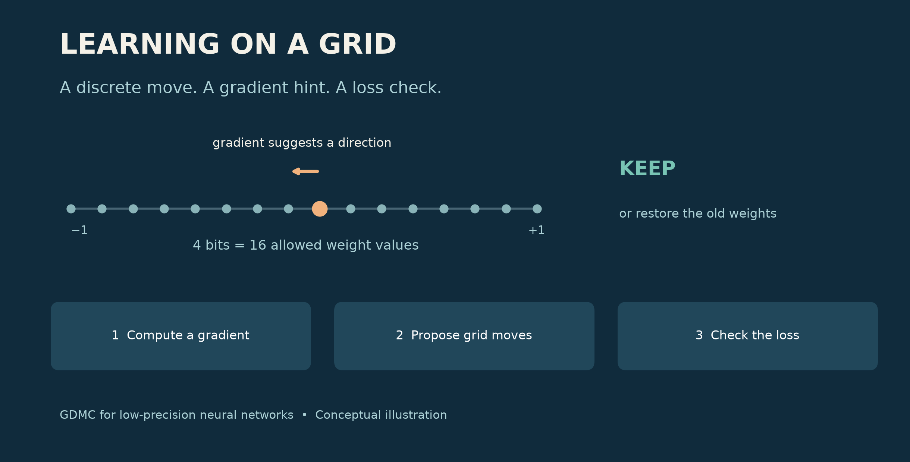
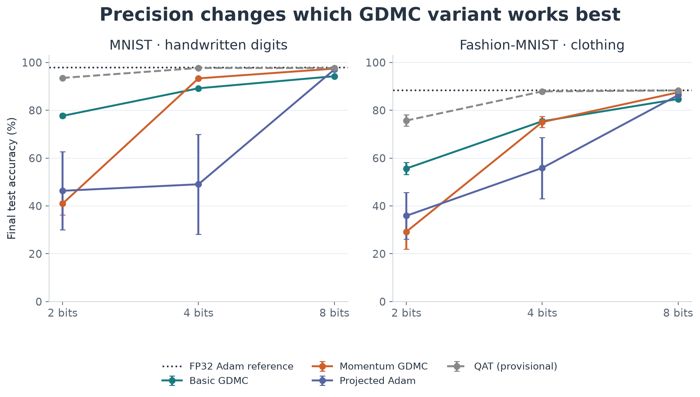
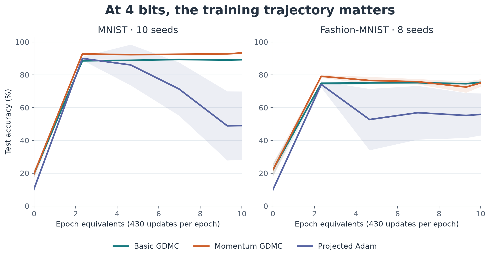
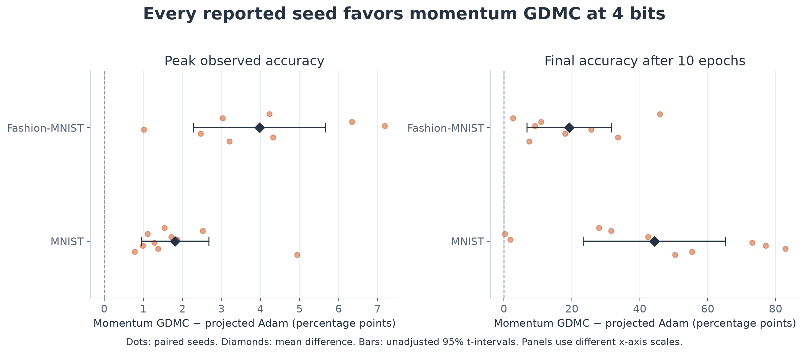

# Can Neural Networks Learn Directly on Low-Bit Weights?

**Revisiting gradient-directed Monte Carlo—from molecular design to a 16-value weight grid.**

By Xiangqian Hu

Imagine training a neural network whose weights can take only 16 values. No hidden, high-precision copy accumulating tiny updates. Every change must land on one of those 16 choices.

Can the network still learn? And does an optimizer designed around discrete moves have an advantage?

Those are the two questions behind this project. The answer to the first is encouraging: **basic gradient-directed Monte Carlo, or GDMC, learns on both handwritten digits and clothing images.** The answer to the second depends on precision. At 4 bits, GDMC with momentum outperforms the projected Adam configuration tested here. At 2 bits, momentum makes GDMC much worse.

That surprise is part of the story. Low-precision training changes more than the number of bits we store. It can change which optimization choices work.

## Why revisit the optimizer?

In my earlier [BinaryNets article](https://huxiangqian.medium.com/binarynets-how-binarized-neural-networks-differ-from-regular-neural-networks-with-toy-code-e5bdbd776606), I explored networks constrained to very limited numerical values. This project asks a related question about learning: what if the optimizer worked directly with those discrete choices?

A weight is an adjustable number that helps determine a network's prediction. A gradient tells us how changing that number would affect the prediction error, or loss. Familiar optimizers such as Adam use gradients to propose small numerical updates.

On a coarse grid, small updates can disappear. With 16 evenly spaced values between −1 and +1, adjacent levels are about 0.133 apart. Move by 0.01 and round back to the nearest level, and the weight may not move at all. Increase the step too much, and training can become unstable.

GDMC takes the grid seriously from the beginning: it proposes a move between allowed values.

## An idea from molecular design

GDMC comes from my earlier work with David Beratan and Weitao Yang on searching discrete chemical spaces. Our [2009 paper](https://pmc.ncbi.nlm.nih.gov/articles/PMC2776780/) applied gradient-directed search to protein sequence design and folding. The broad idea was to use gradient information to guide choices in a space whose actual states were discrete.

Here, the discrete states are neural-network weights. This is an adaptation of that idea, not a claim that a protein-design algorithm transfers unchanged.

The training loop is easy to describe:

1. Compute the usual neural-network gradient at the current weights.
2. Choose a small random subset of weights and propose grid moves in the downhill direction.
3. Compare the loss before and after the proposed move. Keep improvements; sometimes accept a worse move, controlled by a temperature parameter. Otherwise restore the previous weights.

For a loss increase ΔL, the acceptance probability is exp(−βΔL). Larger β makes the decision more selective. This loss-based rule is used here as an optimization heuristic; the experiments do not establish exact sampling guarantees or global optimization.

The **basic version** uses the current gradient. The **momentum version** uses a running average of gradients, so recent history influences the direction. Both variants in the main study move one grid level at a time and select roughly 1% of each parameter tensor per update.

GDMC still uses backpropagation. The change is how it turns a gradient into a weight update.

## A small experiment with a clear question

I used the same fully connected network on two tasks: MNIST, which recognizes handwritten digits, and Fashion-MNIST, which recognizes clothing categories. The network has two hidden layers of 256 units.

Weights use uniform grids with **4 choices at 2 bits, 16 at 4 bits, and 256 at 8 bits**. Each run trains from scratch for ten epochs. The primary study includes ten random seeds for MNIST and eight for Fashion-MNIST—288 final runs across all methods and precisions.

The comparisons answer different questions:

| Method | How it handles weights |
|---|---|
| Basic GDMC | Proposes direct grid moves using the gradient |
| Momentum GDMC | Proposes direct grid moves using averaged gradients |
| Projected Adam / momentum SGD | Applies an optimizer update, then rounds onto the grid |
| Latent-weight QAT | Keeps continuous training weights; quantizes matrix weights in the forward pass |
| FP32 Adam | Full-precision accuracy reference |

The four direct-grid methods each receive three candidate settings, selected on a separate validation split. QAT and FP32 Adam use a fixed learning rate. This is a modest controlled study, not an exhaustive optimizer competition.

One implementation detail matters for interpreting QAT: its biases remain continuous during training but are snapped for evaluation. The direct-grid methods quantize biases during training too. I therefore treat QAT as a **provisional practical reference**, not a perfectly matched comparison.

## First result: basic GDMC really does learn

With no momentum, basic GDMC reaches **89.21% final accuracy on MNIST at 4 bits** and **75.42% on Fashion-MNIST**. At 8 bits, those figures rise to 94.26% and 84.73%.

This answers the first research question at the scale tested: a neural network can learn through gradient-directed moves directly on a small set of weight values.

*Figure 1. Final accuracy after ten epochs. Error bars are 95% t-intervals across seeds. The dotted line is FP32 Adam; QAT is dashed because its training policy differs. Every precision uses the same vertical scale, so low-bit failures remain visible.*

The plot also shows why there is no single “GDMC result.” The basic and momentum variants behave very differently as the grid gets coarser.

## At 4 bits, the training path tells the story

The clearest positive comparison is momentum GDMC against projected Adam at 4 bits.

| Task | Metric | Momentum GDMC | Projected Adam |
|---|---|---:|---:|
| MNIST | Peak observed accuracy | 93.52% | 91.70% |
| MNIST | Final accuracy | 93.35% | 49.07% |
| Fashion-MNIST | Peak observed accuracy | 79.25% | 75.28% |
| Fashion-MNIST | Final accuracy | 75.07% | 55.89% |

The peak advantage is modest but consistent: **1.81 percentage points on MNIST and 3.97 points on Fashion-MNIST**, calculated before rounding the table values. Every reported seed favors momentum GDMC on both the peak and final metrics.

The much larger final gap needs an explanation. Projected Adam often reaches a useful model and then deteriorates. GDMC retains more of its performance, although momentum GDMC also falls from its peak on Fashion-MNIST.

*Figure 2. Mean test accuracy at logged evaluations; shaded bands show 95% t-intervals across seeds. Curves connect measured checkpoints. The mean of individual runs' peaks need not equal the peak of the mean curve.*

This is evidence for **better training stability under these tested settings**. It is not proof that projected Adam must be unstable. Its learning rate is constant, and settings were selected using peak validation accuracy over four epochs before the ten-epoch runs. A longer tuning horizon and learning-rate decay could change the comparison.

*Figure 3. Pairing compares methods using the same seed. Dots show individual differences; diamonds and bars show the mean and its unadjusted 95% t-interval. Peak and final results use different horizontal scales. Positive values favor momentum GDMC.*

“Peak observed accuracy” means the highest logged test accuracy in each run. It is useful for describing these trajectories, but it is test-selected. A follow-up should choose checkpoints on validation data and evaluate them once on the test set.

## The surprise: momentum can hurt badly

Momentum is often a sensible default. At 2 bits, it is the wrong default in these experiments.

| Task, 2-bit weights | Basic GDMC: final accuracy | Momentum GDMC: final accuracy |
|---|---:|---:|
| MNIST | **77.68%** | 40.99% |
| Fashion-MNIST | **55.66%** | 29.23% |

At this precision there are only four levels, separated by about 0.667. A plausible explanation is that a direction averaged over past gradients can keep pushing after a large discrete move has changed the local situation. That is a hypothesis about the mechanism, not something this experiment isolates.

The observation itself is clear: **the basic method should not be dismissed.** On Fashion-MNIST it even slightly exceeds momentum GDMC in final accuracy at 4 bits: 75.42% versus 75.07%.

## At 8 bits, GDMC gets close to full precision

Momentum GDMC finishes at **97.43% on MNIST**, versus **97.92% for FP32 Adam**. On Fashion-MNIST it reaches **87.51%**, versus **88.41%**.

Those are gaps of about 0.49 and 0.90 percentage points. They make direct low-bit optimization worth pursuing. They do not, by themselves, establish statistical equivalence or a universally negligible accuracy cost.

The QAT reference remains stronger overall: its reported final accuracy is 97.70% at 4 bits on MNIST and 87.90% on Fashion-MNIST. Its bias-policy mismatch needs correction, but the present study certainly does not show GDMC beating every way of training a quantized model.

The useful distinction is between **optimizing weights directly on a grid** and **retaining continuous training weights behind a quantized forward pass**. Both deserve comparison; they solve related but different training problems.

## What the other experiments taught me

I also tested the idea that GDMC would tolerate noisy gradients better. The Gaussian-noise study did not support that expectation: at the strongest tested noise level, peak accuracy fell by roughly 2.43 points for 8-bit momentum GDMC, versus 0.48 points for FP32 Adam. This was a separate, three-seed MNIST experiment, not the same protocol as the main comparison.

Turning acceptance off produced the same rounded accuracy results as the same-batch GDMC acceptance rule in that study. Acceptance was close to 100%. So the current evidence does **not** isolate a benefit from the Monte Carlo decision, even though the combined GDMC update is a working optimizer.

The memory probe gives another qualified result. In separate CPU processes with a 21-million-parameter model, total peak memory was about 809 MiB for FP32 Adam, 672 MiB for momentum GDMC with sparse proposals, and 535 MiB for the custom 8-bit-state Adam baseline. Updating every weight with GDMC instead pushed its peak to about 1,470 MiB.

These were three-step measurements, not training-to-convergence cost comparisons. All methods still stored weights as floating-point tensors. **Restricting weights to low-bit values is not the same as packing them into low-bit storage.** The latter—and any resulting GPU, runtime, or energy benefit—remains future work.

The [data and methods companion](appendix.html) includes the noise and memory plots, every primary result, confidence intervals, and the earlier experiments' provenance.

## Where this leaves GDMC

The two research questions now have concrete, bounded answers.

**Does basic GDMC work for deep learning?** Yes, on these two small classification tasks: it learns useful models while moving directly among discrete weight values.

**Can GDMC outperform other methods at the same low precision?** Yes, in a specific comparison: momentum GDMC beats the tested projected Adam at 4 bits on both tasks. Its advantage is especially visible in how much performance survives to the end of training. At 2 bits, the basic variant is substantially stronger than the momentum variant. At 8 bits, momentum GDMC comes within roughly one percentage point of FP32 Adam.

My next priorities are to strengthen the projected baselines, harmonize the QAT policy, test a convolutional network, and implement packed weight storage. I also want a more decisive acceptance ablation: one that determines when checking and rejecting a proposal actually helps.

The most interesting result is that a discrete optimizer can learn at all—and that its best behavior changes with the number of choices each weight has. If low-bit weights are where we want to end up, designing learning rules around those choices deserves a closer look.

---

*Research scope: two 784–256–256–10 MLPs; ten training epochs; 10 MNIST seeds and 8 Fashion-MNIST seeds. This is an experimental report, not evidence of large-model speedups, universal optimizer superiority, or demonstrated noise resilience. Figures and tables were rebuilt from the saved run data.*

*Further reading: [original GDMC paper](https://pmc.ncbi.nlm.nih.gov/articles/PMC2776780/), [my BinaryNets post](https://huxiangqian.medium.com/binarynets-how-binarized-neural-networks-differ-from-regular-neural-networks-with-toy-code-e5bdbd776606), and [complete data and methods](appendix.html).*
